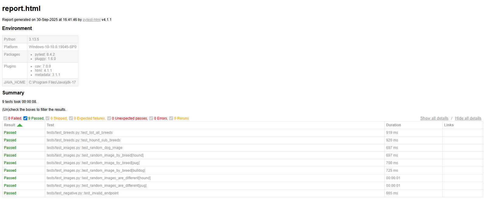

<p align="center">
  <a href="https://www.linkedin.com/in/matias-damian-nazadek/"></a>
</p>
<br>
<div align="center">
    <a href="https://docs.pytest.org/en/stable/"></a>
</div>

# API Testing con PyTest - Dog API

## Sobre el proyecto

En este repositorio se encuentra un conjunto de **tests automatizados** para la [Dog API](https://dog.ceo/dog-api/), desarrollados con **Python** y **PyTest**.  
El objetivo es demostrar habilidades en **automatización de pruebas, parametrización, fixtures y generación de reportes**.

- Podés descargar el repositorio o clonarlo usando:

```bash
git clone https://github.com/matiasdn91/api-testing-pytest.git
```
### Estructura del proyecto

```text
api-testing-pytest/
├── requirements.txt         # Dependencias del proyecto
├── reports/                 # Reportes HTML generados
├── tests/                   # Carpeta con todos los tests
│   ├── conftest.py          # Fixtures
│   ├── test_images.py       # Tests de endpoints que devuelven imágenes
│   ├── test_breeds.py       # Tests de listado de razas y sub-razas
│   └── test_negative.py     # Tests de endpoints inválidos
└── run_tests.py             # Script para ejecutar todos los tests y generar reporte con timestamp
```
### Requisitos:

- Python 3.10+
- PyTest
- requests
- pytest-html

### Instalación de dependencias:

1.Creamos el entorno virtual:
```
python -m venv .venv
```
2.Activamos el entorno virtual:
```
# Linux/Mac
source .venv/bin/activate
# Windows
.venv\Scripts\activate
```
3.Instalamos las dependencias:
```
pip install -r requirements.txt
```  

### Cómo ejecutar los tests:
- Con el script *run_tests.py*, para generar un reporte HTML en la carpeta reports/ con timestamp, y asi no sobrescribir archivos anteriores:
```
python run_tests.py
```
- O manualmente con PyTest, para generar un único reporte HTML sobrescribiendo el reporte existente:
```
pytest -v --html=reports/report.html --self-contained-html
```
### Qué se está testeando:

- Endpoints que devuelven imágenes aleatorias (/breeds/image/random, /breed/{breed}/images/random).

- Listado de razas y sub-razas (/breeds/list/all, /breed/{breed}/list).

- Tests parametrizados para varias razas.

- Tests negativos (endpoints inválidos).

- Consistencia de imágenes aleatorias (verifica que no se repitan URLs).

### Notas:

Los reportes HTML están ignorados en GitHub (reports/) para mantener el repositorio limpio.

### Ejemplo de reporte HTML

<p align="center">
  
</p>

> El reporte incluye detalles de cada test ejecutado, su resultado (passed/failed), tiempo de ejecución y metadatos del entorno.